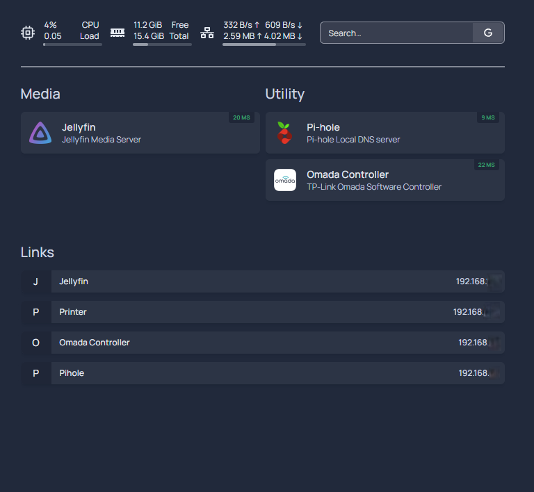

# Kube-Home: Advanced Kubernetes Home Server Setup

## Overview
This guide documents the set up of a single-node Kubernetes cluster on Ubuntu 24.04 LTS Server using MicroK8s or K3s. It includes configurations for persistent storage, networking and the deployment of essential services like Pi-hole, Jellyfin and Homepage. Services are exposed using both LoadBalancer, and Gateway API through Kong Gateway for ingress management.

This setup can serves as a flexible starting point for building a Kubernetes-based home server. While based on personal preferences, it can be easily customized to suit individual needs.

Here’s what the homepage looks like once services are up and running:



## Table of Contents

1. [Overview](#overview)  
2. [Tech Stack](#tech-stack)  
3. [Base System Installation](#base-system-installation)  
4. [Kubernetes Setup (K3s or MicroK8s)](#kubernetes-setup-k3s-or-microk8s) 
5. [MetalLB Setup](#metallb-load-balancer-setup)  
6. [Service Deployments](#service-deployments)  
7. [Kong Gateway Setup with Gateway API](#kong-gateway-setup-with-gateway-api)  
8. [License](#license)

## Tech Stack

This section provides an overview of the core components used in the homelab setup:

| Component            | Description                                       |
| -------------------- | ------------------------------------------------- |
| **Ubuntu 24.04 LTS** | Host operating system                             |
| **K3s / MicroK8s**   | Lightweight Kubernetes distributions              |
| **Local Path Provisioner** | HostPath-based CSI driver for local persistent storage |
| **MetalLB**          | LoadBalancer implementation for bare-metal setups |
| **Pi-hole**          | DNS-level ad blocking and local DNS resolver      |
| **Jellyfin**         | Media streaming server                            |
| **Omada Controller** | TP-Link SDN network controller                    |
| **Homepage**         | Centralized dashboard linking homelab services    |
| **Kong Ingress Controller (KIC)** | Manages Gateway API for Kong Gateway |

## Base System Installation
### Hardware Requirements
This homelab setup can run on both bare-metal and virtualized environments. A minimum of 2 CPU cores, 8GB of RAM and 20-30GB of disk space is recommended for smooth operation.

For reference, I use a Beelink Mini S12 Pro with an Intel N100 CPU (4 cores) and 16 GB RAM. It idles at 4–5% CPU and 23% memory usage with all current services running. Resource needs vary by service load — scale your hardware as needed.

### OS Installation

- Install **Ubuntu 24.04 LTS Server**
- Set hostname: `k8s-test-1`
- Enable `ssh`
- Create user: `ubuntu`

>Most Kubernetes manifests in this project assume the hostname `k8s-test-1`, particularly for PersistentVolume declarations. If you choose a different hostname, be sure to update the relevant manifests accordingly.

### Persistent Volume Configuration

Kubernetes manifests in this setup use `/data/k8s-local` as the centralized location for persistent container data.

>💡 **Optional**: You can create a dedicated LVM volume for `/data` to separate persistent data from the root filesystem.
```bash
# Display existing volume groups
sudo vgdisplay -v

# Create a new logical volume (replace <size> with the desired size in GB)
sudo lvcreate -L <size>G -n data-lv /dev/ubuntu-vg

# Format it with XFS
sudo mkfs.xfs /dev/ubuntu-vg/data-lv

# Check UUID for fstab entry
lsblk -f /dev/ubuntu-vg/data-lv
```
Edit `/etc/fstab` to mount on boot
```bash
UUID=<UUID_STRING>  /data  xfs  defaults,noatime,nodiratime  0  2
```
Then, mount the volume 
```bash
sudo mkdir /data
sudo mount /data
```
➡️ Create the directory for Kubernetes persistent data. This is required regardless of volume creation.
```bash
sudo mkdir -p -m 750 /data/k8s-local
```

## Kubernetes Setup (K3s or MicroK8s)

Install either **K3s** or **MicroK8s**. Both are lightweight Kubernetes distributions well-suited for homelab use cases. They are easy to install and require minimal maintenance.

### Install K3s

Install a single-node K3s cluster:
```bash
# Install K3s without Traefik and built-in service load balancer
sudo su
curl -sfL https://get.k3s.io | INSTALL_K3S_EXEC="--disable=traefik --disable=servicelb" sh -
```
Verify that the cluster is running

```bash
kubectl get nodes -o wide
systemctl status k3s
```

### Install Microk8s
Install single node Microk8s cluster
```bash
sudo snap install microk8s --classic  
```
Verify microk8s is running
```bash
  sudo microk8s status --wait-ready 
  sudo microk8s kubectl get nodes -o wide
```
Ensure essential MicroK8s add-ons are enabled
```bash   
  sudo microk8s enable rbac
  sudo microk8s enable dns
  sudo microk8s enable hostpath-storage
  sudo microk8s enable helm3
```
### Remote Access with Kubectl
If you prefer to acesses the Kubernetes cluster from a remnote server using kubectl, export the kubeconfig file and copy it to your remote host.
```bash
# Microk8s
sudo microk8s config > kubeconfig-microk8s.yaml

# K3s
sudo cat /etc/rancher/k3s/k3s.yaml > kubeconfig-k3s.yaml
```
Copy the file to your remote host and edit it. In the copied YAML file, update the server: address to the real IP address of your Kubernetes node:
```bash
clusters:
- cluster:
    server: https://<NODE-IP>:6443
```

Check the current kubectl version on the node
```bash
# MicroK8s
microk8s kubectl version

# K3s
k3s kubectl version
```

Install matching kubectl version to your remote host. Replace v1.x.y with the version from above. 

```bash
K8S_VERSION=v1.x.y     
curl -LO https://dl.k8s.io/release/${K8S_VERSION}/bin/linux/amd64/kubectl
sudo install -o root -g root -m 0755 kubectl /usr/local/bin/kubectl
```
💡 Version compatibility:
kubectl is officially supported if its minor version is within ±1 of the Kubernetes API server version. For example, if your cluster is running Kubernetes v1.32.4, you can safely use kubectl version v1.31, v1.32, or v1.33. Patch versions (e.g., v1.32.*) are fully compatible and can be updated freely.

Access the cluster using the edited kubectl config file
```bash
export KUBECONFIG=~/kubeconfig-<k3s|microk8s>.yaml
kubectl get nodes -o wide
```

For detailed installation and configuration instructions, refer to the official Kubernetes documentation: [Install `kubectl`](https://kubernetes.io/docs/tasks/tools/install-kubectl-linux/#install-kubectl-binary-with-curl-on-linux)


## MetalLB Setup
MetalLB enables LoadBalancer services in bare-metal clusters by assigning external IPs from a local address pool. This is critical for homelabs where cloud load balancers are unavailable. 

⚠️ Install MetalLB after Kubernetes setup and before deploying services that require external access. Choose an IP range that does not overlap with your DHCP server.

### MetalLB for K3s

Install MetalLB with Helm
```bash
helm install metallb metallb/metallb --namespace metallb-system --create-namespace
```
Edit template file `metallb-addresspool.yaml` and include the IP range(s). Then apply the configuration.
```bash
cd ./metallb
kubectl apply -f metallb-L2Advertisement.yaml -f metallb-addresspool.yaml
```

### MetalLB for Microk8s

  Decide the IP range MetalLB should use to automatically allocate IPs. Be sure to use an IP range that does not overlap with your local network DHCP range.

  Enable  Metallb Add-on. You will be prompted to enter the IP address range. Choose one outside your DHCP scope.
  ```bash  
  sudo microk8s enable metallb
  ```

To update the IP range later:
```bash
# Export current config
kubectl get -n metallb-system ipaddresspool default-addresspool -o yaml  > default-addresspool.yaml
# Edit the file and then re-apply
kubectl apply -f  default-addresspool.yaml  
```

## Service Deployments

Initially, each service is exposed using a `LoadBalancer` service to simplify connectivity and testing. Once verified, a centralized Gateway API configuration is introduced using Kong as the gateway controller.

> ⚠️ Ensure MetalLB is installed and configured before deploying any services. See the [MetalLB Load Balancer Setup](#metallb-load-balancer-setup) for details.

### Pi-hole DNS Server

Pi-hole provides DNS resolution and ad-blocking for the network.

Create the directory for persistent data:
```bash
sudo mkdir -p -m 750 /data/k8s-local/pihole/etc
```
Choose one of the following options to deploy Pi-hole:

Option 1 – Manual deployment using base manifests. 
Edit the templates under pihole/base, then deploy:
```bash
cd ./pihole/base
kubectl apply -f pihole-ns.yaml
kubectl apply -f pihole-pv.yaml
kubectl apply -f pihole-pvc.yaml
kubectl apply -f pihole-cm.yaml
kubectl apply -f pihole-secret.yaml
kubectl apply -f pihole-deployment.yaml
kubectl apply -f pihole-svc.yaml
```
Option 2 – Deploy using Kustomize overlay. Review and modify patch.yaml, configs.txt, and secrets.txt in the overlay directory. Then deploy:
```bash
cd ./pihole/overlays/template

# Preview final manifest
kubectl kustomize .

# Check syntax
kubectl kustomize . | kubectl apply -f - --dry-run=client

# Apply
kubectl kustomize . | kubectl apply -f -
```
Verify deployment and access the web UI:

```bash
kubectl get svc -n pihole -o wide  # Note the LoadBalancer EXTERNAL-IP
```
Visit:
http://\<external-ip\>/admin/login

### Jellyfin Media Server
Create local directories for persistent data volumes:
```bash
sudo mkdir -p -m 750   /data/k8s-local/jellyfin/config
sudo mkdir -p -m 750   /data/k8s-local/jellyfin/cache
sudo mkdir /data/media  # Directory for media files
```

Edit jellyfin manifest templates and then deploy
```bash
cd ./jellyfin
kubectl kustomize | kubectl apply --dry-run=client -f -  # Check syntax
kubectl kustomize | kubectl apply -f -
```
Verify deployment
```bash
kubectl get svc -n jellyfin  # Check LoadBalancer EXTERNAL-IP
http://<external-ip>  # Check access with browser
```

### Omada Software Controller
Omada Software controller is relevant only if you have TP-Link Omada network devices.

Create local directories for persistent data volumes
```bash
sudo mkdir -p -m 750 /data/k8s-local/omada/data
sudo mkdir -p -m 750 /data/k8s-local/omada/logs
```
Edit templates and deploy
```bash
cd ./omada
kubectl kustomize .   # Check final yaml output  before applying it
kubectl kustomize . | kubectl apply -f - 
```
Verify
```bash
kubectl get svc -n omada  # Check LoadBalancer EXTERNAL-IP
http://<external-ip>      # Check access with browser
```
### Homepage
A simple central homepage for accessing all deployed services.

Edit templates and deploy
```bash
cd ./homepage  
kubectl kustomize . | kubectl apply -f - --dry-run=client
kubectl kustomize . | kubectl apply -f -
```

Verify service has internal ClusterIP and deployment is OK
```bash
kubectl get deployment,svc -n homepage 
```
## Kong Gateway Setup with Gateway API
Kong Gateway is configured using Gateway API resources via the Kong Ingress Controller (KIC), which acts as the control plane.
### Choose Your DNS domain
This setup uses host-based routing (e.g. jellyfin.home.example.com) via Kong Gateway. For routing to work, a functioning local DNS (like Pi-hole) must resolve these domain names to the Kong proxy's external IP. Alternatively, you can define static entries in your system’s hosts file (e.g., /etc/hosts on Linux or macOS).

>The key requirement is that each fully qualified domain name resolves to the Kong LoadBalancer IP.

If you don't have a public domain, you can use a custom local-only domain for internal DNS resolution. Suitable examples include:

- `example.home`
- `example.lan` – commonly used in local networks (e.g., Pi-hole default)
- `example.internal`
- `example.com` – used throughout this project's manifests; [reserved for documentation and testing](https://datatracker.ietf.org/doc/html/rfc2606), safe to use in local environments

> **Note:** Ensure your DNS server (e.g., Pi-hole, dnsmasq, or local resolver) is properly configured to resolve these custom domains to the correct internal IPs.

Avoid .local, which is reserved for mDNS and may cause conflicts.

All provided HTTPRoute templates and the Kong gateway manifest in this repo usehome.example.com as a placeholder. Replace it with your actual domain and make sure your DNS server maps the relevant records to the Kong proxy IP as explained later in chapter [Configure Pi-hole DNS server](#configure-pi-hole-dns-server)

### Install Kong
Install Gateway API CRDS (standard channel)
```bash
kubectl apply -f https://github.com/kubernetes-sigs/gateway-api/releases/download/v1.3.0/standard-install.yaml
```
Install Kong Ingress Controller
```bash
helm repo add kong https://charts.konghq.com
helm repo update
helm install kong kong/ingress -n kong --create-namespace 
```
First edit templates and then create gatewayclass and gateway resources
```bash
cd ./gateway/kong
kubectl apply -f gateway-ns.yaml -f kong-gc.yaml -f  kong-gtw.yaml 
```

Verify connectivity to Kong via the external proxy address:
```bash
kubectl get svc -n kong kong-gateway-proxy  # Check LoadBalancer EXTERNAL-IP of the proxy
curl -i <external-ip>  # Check connectivity to Kong proxy, use the LB EXTERNAL-IP
```
If Kong is working correctly, the `curl` output should show below HTTP 404 error as no routes have been configured yet. By default, Kong returns a 404 error when it cannot match a request to any defined route. Once you configure HTTP routes, Kong will forward requests to the appropriate backend services based on the routing rules.

```
HTTP/1.1 404 Not Found
Content-Type: application/json; charset=utf-8
Connection: keep-alive
Content-Length: 48
X-Kong-Response-Latency: 0
Server: kong/3.0.0
 
{"message":"no Route matched with those values"}
```


### Configure Pi-hole DNS Server
Login to the Pi-hole admin console and add DNS records that resolve the Kong proxy external IP to your service hostnames.

Pi-hole UI path: *Setting -> Local DNS records*

| Domain                    | IP Address                 | 
| -----------------------   | ------------------------   | 
| proxy.home.example.com    | \<kong-proxy-external-ip\> | 
| jellyfin.home.example.com | \<kong-proxy-external-ip\> |
| omada.home.example.com    | \<kong-proxy-external-ip\> |
| pihole.home.example.com   | \<kong-proxy-external-ip\> |

Ensure Pi-hole domain is set correctly (e.g., home.example.com). You can set this via:
- Environment variable:  `FTLCONF_dns_domain`
- Admin UI: *Settings -> All Settings -> dns.domain*

(Pi-hole default is *lan*)
Finally, configure your client system to use the Pi-hole Kubernetes service LoadBalancer IP as its DNS server (not the Kong proxy IP).

You can then verify DNS resolution:
```bash
curl http://proxy.home.example.com
```

### Attach HTTP routes to Kong Gateway
HTTP routes define how incoming requests are forwarded to backend services based on hostnames, paths, or other criteria. In this section, HTTP routes are configured to enable access to the services through the Kong Gateway.

Review httproute templates and attach them to Kong gateway to get access to the services via the proxy IP address. Most route templates are based on hostnames, with some also including path-prefix routing. Before applying routes, ensure the `hostnames` field in each HTTPRoute template matches your domain name as configured in the DNS. Here is snippet from `homepage-route.yaml` template:

```yaml
hostnames:
  - proxy.home.example.com
```

Review and edit templates, then apply:
```bash
cd ./gateway/kong
kubectl apply -f homepage-route.yaml  # Hostnames + PathPrefix route
kubectl apply -f jellyfin-route.yaml  # Hostnames + PathPrefix route
kubectl apply -f pihole-route.yaml    # Hostnames route
kubectl apply -f omada-route.yaml     # Hostnames route
```
Verify the state of gateway and routes
```bash
# Check state of gateway and all routes
kubectl get gc,gtw,httproute -A

# Describe a specific HTTP route for detailed information
kubectl describe -n <namespace> httproute <httproute_name>
```
If gateway, HTTP routes and DNS are working properly, you should be able to access the following URLs in a browser:

- http://proxy.home.example.com :  Access the Homepage service
- http://\<gateway-proxy-ip-address\> : Access the Homepage service
- http://jellyfin.home.example.com : Access the Jellyfin service
- http://\<gateway-proxy-ip-address\>/jellyfin/  # Access the Jellyfin service (keep trailing /)
- and so on...

## License

This project is licensed under the [MIT License](./LICENSE).

